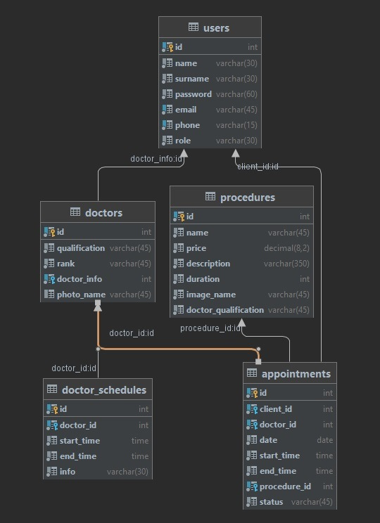

# Medicine centre "StartUp CLINIC" 
The web-system is an online representation of clinic. The system contains catalog of procedures. 
The user can choose procedure,doctor,date,time and make an appointment. 
The doctor can view appointments to him.  
The moderator manages appointments and users.
The administrator manages catalog, doctors, appointments and users.
To make the appointment user needs to sign in.
### User roles and functions available to them:
|function|	ADMIN| 	MODERATOR| 	USER| 	DOCTOR | GUEST|
|---------|-------|-------|------|----------|--------|
|change language|	* |	* |	* |	*| * |
|change user role(admin,moderator,doctor,user)|	*|*|		|  |  |
view all users and their information	|*|*||||
view all procedures	|*|	*|	*|	*| *|
view all doctors	|*|	*|	*|	*| *|
change information and image procedure|*|||||		
add procedure	|*|||||		
add appointment		|||*||	
view all your appointments		|||*||
view all appointments|*|*|||	
view all to you appointments			||||*|
change appointment	|*|*|||
confirm appointment	|*|*|||
cancel appointment	|*|*|||
add schedule		|*|||||
change schedule|*|||||
delete schedule|*|||||
view all doctor's schedule |*|*||||
view account information	|*|*|*|*||
change account information	|*|*|*|||	
logout	|*|*|*|*||
singing in		|*|*|*|*||
create new account	|||*|||	

# Appointment lifecycle
1. Appointment creating.
  User can create appointment, he must choose doctor,date and time. After creating appointment has status "CLAIMED". 
2. Appointment confirmation.
   Moderator (receptionist) can see all created appointments.Moderator can see all information about appointment and client. Moderator call client and then can confirm appointment(change status on "CONFIRMED"), can change appointment or can cancel appointment (change status on "CANCELED"). Also Moderator can see all other appointments to the chosen doctor, for double check. 

# Database tables
